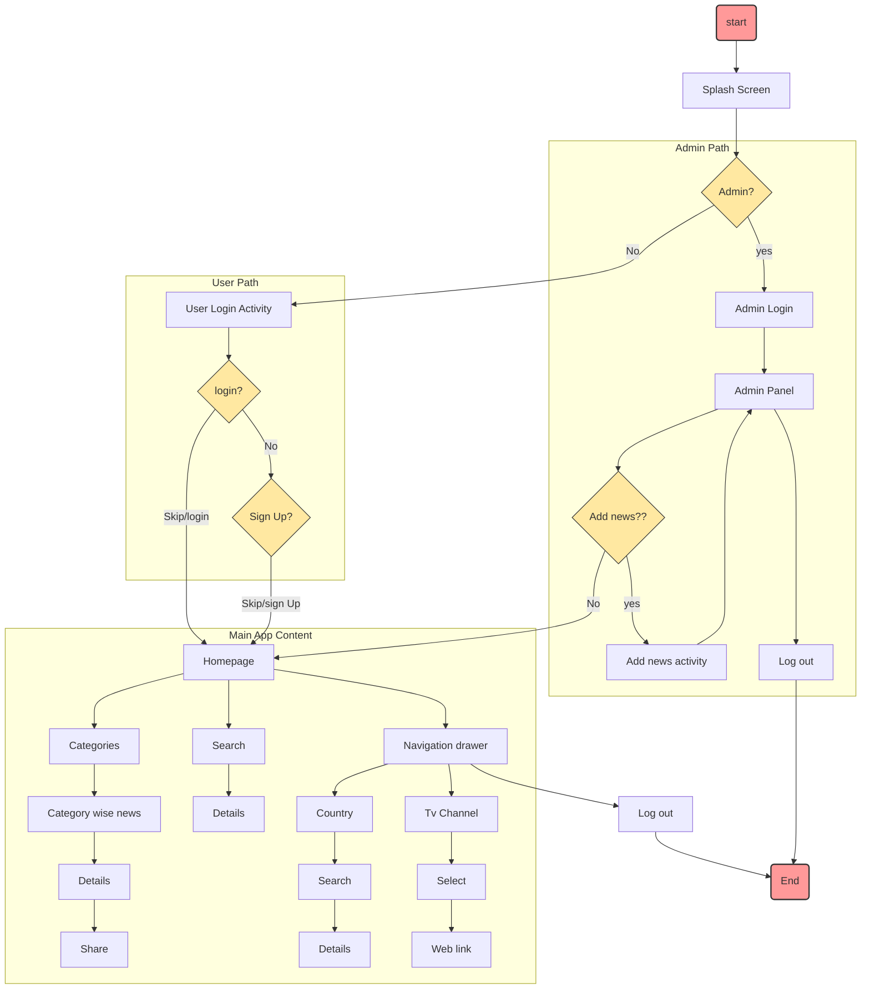

Full project overview: [project presentation.pptx](https://github.com/user-attachments/files/16580368/project.presentation.pptx)
# 📰📱 NewsINFINITY: A Dynamic Android News Platform

*A full-stack, dual-panel news application for Android, built with Java and powered by a real-time Google Firebase backend. This platform provides a seamless content management system for administrators and an intuitive, categorized news-reading experience for users.*

---

## 1. Project Overview

In a fast-paced world, access to timely and organized information is crucial. NewsINFINITY is a mobile-first platform designed to bridge the gap between content creators and consumers. The app allows authenticated administrators to publish news articles across various categories, which are then instantly available to all users on their Android devices in real-time.

The system is built on a client-server model, with a native Android front-end and a powerful, serverless **Google Firebase** backend for data storage, user authentication, and real-time data synchronization.

## 2. Tech Stack

| Category | Technologies |
|---|---|
| **Mobile Front-End** | Java, XML, Android Studio |
| **Backend & Database** | Google Firebase (Cloud Firestore, Firebase Authentication) |
| **Core Concepts** | MVC Architecture, Real-time Database, NoSQL Data Modeling |

## 3. Key Features

The application features a dual-panel design with distinct functionalities for administrators and users, creating a complete content ecosystem.

### 🔑 Admin Panel: The Control Center
A secure, backend-facing interface for complete content management.
- **Secure Authentication:** Admins have a separate, dedicated login portal to access management functions.
- **Real-time Content Management (CRUD):** Admins can create, read, update, and delete news articles directly.
- **Dynamic Publishing:** Any new article published via the admin panel is instantly pushed to all user devices without needing an app update, thanks to the real-time nature of Firebase.
- **Centralized Control:** Manage all news content, user-facing categories, and sources from a single, streamlined interface.

### 🧑‍💻 User Panel: The Reader's Experience
An intuitive and feature-rich interface designed for an optimal news consumption experience.
- **Flexible Access:** Users can sign up for a personalized experience or choose to skip registration and browse news immediately.
- **Full User Authentication:** Includes user sign-up, login, and a secure password reset functionality handled by Firebase Authentication, which sends a reset link to the user's email.
- **Dynamic News Discovery:**
    - A homepage featuring "Breaking News" and a horizontal scroller for news categories.
    - A powerful search function to find articles by keywords.
    - The ability to filter news by country using an auto-completing search view.
- **Enhanced Connectivity:**
    - A built-in share feature to send interesting articles to other apps (e.g., WhatsApp, Gmail).
    - The ability to link directly to external news channel websites from within the app.

## 4. System Architecture & Data Flow

The application follows a logical, event-driven flow, ensuring a clear and efficient user journey from launch to news consumption. The flowchart below illustrates the high-level architecture and the paths for both user and admin roles within the system.





## 5. Backend Spotlight: Cloud Firestore (NoSQL Database)

The core of this project's backend is **Cloud Firestore**, a flexible, scalable NoSQL document database. This choice was deliberate, as the document-based model is ideal for applications like a news app where content structures can evolve and fast, real-time queries are essential.

Our data model consists of several key **collections**:
- `Admin`: Stores credentials for authenticated administrators.
- `Categories`: Holds the list of news categories displayed to users.
- `CountryWiseNews`: A collection where each document represents a country, containing its specific news articles. This allows for efficient geographic filtering.
- `User`: Stores profile information for registered readers.

> **Data Analyst Takeaway:** This project demonstrates practical experience in designing and implementing a NoSQL database schema, managing data through CRUD operations, and leveraging a real-time backend to power a dynamic front-end application. This showcases a strong understanding of modern, non-relational data structures.

## 6. How to Run This Project

### Prerequisites
- [Android Studio](https://developer.android.com/studio) (latest version recommended)
- An Android Virtual Device (AVD) configured in Android Studio, or a physical Android device.

### Setup Instructions

1.  **Clone the Repository:**
    ```bash
    git clone https://github.com/shafiatunnurshimu23/News_INFINITY.git
    ```

2.  **Open in Android Studio:**
    - Launch Android Studio and select "Open".
    - Navigate to the cloned `News_INFINITY` directory and select it.

3.  **Sync Gradle Dependencies:**
    - Android Studio will automatically sync the project's Gradle files, downloading all necessary libraries like the Firebase SDK.

4.  **Set Up Firebase (Crucial Step):**
    - This project requires a `google-services.json` file to connect to a Firebase project.
    - Go to the [Firebase Console](https://console.firebase.google.com/) and create a new, free project.
    - Inside your Firebase project, enable **Firestore Database** and **Firebase Authentication** (with the Email/Password provider).
    - Add an Android app to your Firebase project. You will need to provide the package name, which you can find in this project's `app/build.gradle` file.
    - Download the `google-services.json` file that Firebase generates for you.
    - Place this downloaded file into the `app` directory of the Android project (e.g., `News_INFINITY/app/google-services.json`).

5.  **Run the Application:**
    - Select your configured AVD or connect a physical device.
    - Click the "Run" button (▶️) in Android Studio. The app will build, install, and launch.
